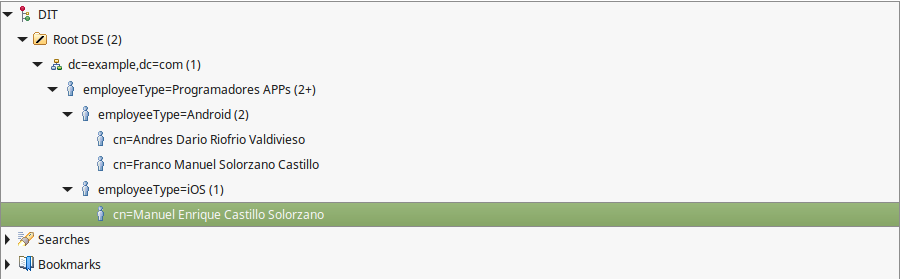

# LDAP-Postgres-Connection
Conección entre LDAP, Postgres, Node.js y Apache Directory Studio por medio de ODBC. Con ejemplo de creación de grupo y subgrupos y autentificación con Node.js (Este tutorial ha sido realizado en Linux Mint 18.1 por lo que en ubuntu 16.04 debería correr sin problema). Entonces en este tutorial se realiza la siguiente arquitectura(sin tomar encuenta conexión jBPM):

Y se crea la siguiente estructura en Apache Directory Studio

Con la finalidad de no tener problemas durante las configuraciones correspondientes o en caso de tener uno de los siguientes errores se recomienda ver los guientes errores que se pueden dar con sus soluciones:
------------------------------------------------------------------------------------

configure: error: C compiler cannot create executables

sudo apt-get install g++
------------------------------------------------------------------------------------

configure: error: readline library not found
If you have readline already installed, see config.log for details on the
failure. It is possible the compiler isn’t looking in the proper directory.
Use –without-readline to disable readline support.

sudo apt-get install libreadline6-dev
------------------------------------------------------------------------------------

configure: error: zlib library not found
If you have zlib already installed, see config.log for details on the
failure. It is possible the compiler isn’t looking in the proper directory.
Use –without-zlib to disable zlib support.

sudo apt-get install zlib1g-dev
------------------------------------------------------------------------------------

checking for CRYPTO new ex data in -lcrypto... no
configure: error: library ’crypto’ is required for OpenSSL

sudo apt-get install libssl-dev
------------------------------------------------------------------------------------

configure: error: libpq library version ¿= 9.2 is required

sudo apt-get install libpq-dev
------------------------------------------------------------------------------------

configure: error: could not locate libtool ltdl.h

sudo apt install libltdl-dev
------------------------------------------------------------------------------------

connections on Unix domain socket ”/tmp/.s.PGSQL.5432”?

Instalar postgres en: /usr/local/pgsql en caso de tenerlo en otro lado revisar el path y luego en el paso posterior donde se inserta en el terminal sudo nano /etc/profile.d/path.sh colocarlo correctamente
------------------------------------------------------------------------------------

createdb: /usr/local/pgsql/lib/libssl.so.1.0.0: no version information available (required by
/usr/local/lib/libldap r-2.4.so.2)

sudo ln -fs /usr/lib/liblber-2.4.so.2 /usr/local/lib/
------------------------------------------------------------------------------------
sudo ln -fs /usr/lib/libldap r-2.4.so.2 /usr/local/lib/
------------------------------------------------------------------------------------

# Configuración e Instalación de ODBC

Para la instalación de unixODBC ejecutar en el terminal:

cd /usr/local/src/
------------------------------------------------------------------------------------
sudo wget http://www.unixodbc.org/unixODBC-2.3.4.tar.gz
------------------------------------------------------------------------------------
sudo tar xzf unixODBC-2.3.4.tar.gz
------------------------------------------------------------------------------------
cd unixODBC-2.3.4/
------------------------------------------------------------------------------------
sudo ./configure
------------------------------------------------------------------------------------
sudo make
------------------------------------------------------------------------------------
sudo make install
------------------------------------------------------------------------------------

Al finalizar la instalación, es necesario agregar el directorio de instalación bin de Postgres (en este caso /usr/local/pgsql/bin) a la variable de entorno PATH, y configurar correctamente la variable de entorno LD LIBRARY PATH. Entonces ejecutar en el terminal 

sudo nano /etc/profile.d/path.sh 
------------------------------------------------------------------------------------

y pegar el contenido del path.sh adjunto (Cambiar el path en caso de que postgres no este instalado en /usr/local/pgsql). Finalmente actualizar el perfil bash ejecutando:

sudo source /etc/profile.d/path.sh
------------------------------------------------------------------------------------

En caso de que no funcione el código anterior se puede ejecutar:

sudo -s source /etc/profile.d/path.sh
------------------------------------------------------------------------------------

Para la instalación de psqlODBC ejecutar en el terminal:

cd /usr/local/src/
------------------------------------------------------------------------------------
sudo wget https://ftp.postgresql.org/pub/odbc/versions/src/psqlodbc-10.00.0000.tar.gz
------------------------------------------------------------------------------------
sudo tar xzf psqlodbc-10.00.0000.tar.gz
------------------------------------------------------------------------------------
cd psqlodbc-10.00.0000/
------------------------------------------------------------------------------------
sudo ./configure -help
------------------------------------------------------------------------------------
sudo ./configure -with-unixodbc
------------------------------------------------------------------------------------
sudo make
------------------------------------------------------------------------------------
sudo make install
------------------------------------------------------------------------------------

Para configurar ODBC establecer correctamente los valores para el usuario, contraseña (los
cuales deben ser creados en la base de datos Postgres también) y postgres. Para ello ejecutar en el terminal 

sudo nano /usr/local/etc/odbc.ini 
------------------------------------------------------------------------------------

y pegar todo el script que se encuentra en el documento adjunto odbc.ini, el mismo que contiene el username y password de un usuario en la base de datos de postgres. Entonces, para este caso se ha creado en postgres un usuario llamado ldap con password 1234, además de una base de datos denominda pg_ldap que contendra todos los elementos que leerá el OpenLdap.

Resta configurar el driver ODBC “Postgres”: Entonces después de insertar en el terminal

sudo nano /usr/local/etc/odbcinst.ini 
------------------------------------------------------------------------------------

para finalmente pegar la información del archivo odbcinst.ini adjunto.

# Configuración e Instalación de OpenLDAP

Con la finalidad de instalar OpenLDAP ejecutar los siguientes comandos:

cd /usr/local/src/
------------------------------------------------------------------------------------

sudo wget http://gpl.savoirfairelinux.net/pub/mirrors/openldap/openldap-release/openldap-2.4.45.tgz
------------------------------------------------------------------------------------

sudo tar xzf openldap-2.4.45.tgz
------------------------------------------------------------------------------------

sudo chown -R root:staff openldap-2.4.45
------------------------------------------------------------------------------------

cd openldap-2.4.45/
------------------------------------------------------------------------------------

sudo less INSTALL
------------------------------------------------------------------------------------

sudo ./configure --help
------------------------------------------------------------------------------------

sudo apt-get install libtool libssl-dev
------------------------------------------------------------------------------------

sudo ./configure --enable-crypt --enable-modules --enable-rlookups --enable-sql=yes --with-tls=openssl --without-cyrus-sasl --disable-bdb --disable-hdb --disable-ipv6
------------------------------------------------------------------------------------

sudo make depend
------------------------------------------------------------------------------------

sudo make
------------------------------------------------------------------------------------

sudo make install
------------------------------------------------------------------------------------

Para configurar OpenLDAP acceder al archivo slapd.conf y poner los datos solicitados como esta en el archivo adjunto. Para ello, primero ejecutar los comandos: 

cd /usr/local/etc/openldap/
------------------------------------------------------------------------------------
sudo cp /usr/local/src/openldap-2.4.45/servers/slapd/back-sql/rdbms_depend/pgsql/slapd.conf .
------------------------------------------------------------------------------------
sudo nano slapd.conf
------------------------------------------------------------------------------------

Y realizar las modificaciones a los parámetros database, suffix, rootdn, rootpw, dbname, dbuser, dbpasswd a corde a la configuración del ODBC. Tal como esta el slapd.conf adjunto.

Ir al directorio /usr/local/src/openldap-2.4.45/servers/slapd/back-sql/rdbms_depend/pgsql/ por terminal o GUI y reemplazar los archivos: backsql_create.sql, testdb_create.sql, testdb_metadata.sql por los adjunto en este tutorial. En el último archivo "testdb_metadata.sql" en la linea 56 tiene el directorio raiz "dc=example,dc=com", en caso de haberlo cambiado en las configuraciones del LDAP, modificarlo aqui caso contrario dejar como esta.  

A continuación se debe crear la estructura de base de datos para LDAP. Esta estructura es necesaria para que LDAP funcione con SQL como backend. Para ello ingresar al directorio servers/slapd/back-sql/rdbms_depend/pgsql/ y crear la metadata que se utilizara como backend ejecutando el script SQL backsql_create.sql. Para ello en la terminal ejecutar como usuario postgres lo siguiente (el usuario postgres se crea cuando instala postgres, su clave no es la misma con la que entra a la base de datos, esta debe crearla como cualquier otro usuario de linux colocando en el terminal "passwd postgres"):

su - postgres
------------------------------------------------------------------------------------
createdb pg_ldap
------------------------------------------------------------------------------------
createuser -D -R -S -W ldap
------------------------------------------------------------------------------------

Ir al pgadmin4 y colocar al usuario ldap la clave 1234 y dar todos los permisos deseados. luego conntinuar Con:

cd /usr/local/src/openldap-2.4.45/servers/slapd/back-sql/rdbms_depend/pgsql/
------------------------------------------------------------------------------------
psql -d pg_ldap < backsql_create.sql
------------------------------------------------------------------------------------
psql -d pg_ldap < testdb_create.sql 
------------------------------------------------------------------------------------
psql -d pg_ldap < testdb_metadata.sql
------------------------------------------------------------------------------------

Los errores arrojados por ambos scripts se deben a que intentan eliminar tablas que aún no existen (están pensados para limpiar una instalación preexistente). Simplemente ignorar estos errores y continuar digitando desde el usuario postgres con el fin de dar permisos:

psql -d pg_ldap
------------------------------------------------------------------------------------
grant all on ldap_attr_mappings,ldap_entries,ldap_entry_objclasses,ldap_oc_mappings,referrals,certs to ldap;
------------------------------------------------------------------------------------
grant all on ldap_attr_mappings_id_seq,ldap_entries_id_seq,ldap_oc_mappings_id_seq,referrals_id_seq to ldap;
------------------------------------------------------------------------------------
grant all on authors_docs,documents,institutes,persons,phones to ldap;
------------------------------------------------------------------------------------
grant all on documents_id_seq,institutes_id_seq,persons_id_seq,phones_id_seq to ldap;
------------------------------------------------------------------------------------

Con el fin de determinaar si toda la conexión LDAP-Postgres por medio de ODBC ha sido correcta se puede digitar en una nueva terminal:

1) Para verificar conexion ODBC ejecutar en la terminal:

isql -v PgSQL
------------------------------------------------------------------------------------
select name from persons;
------------------------------------------------------------------------------------

Obteniendo como resultado una tabla vacía, acorde a los datos insertados en postgres a lo que ejecutamos anteriormente: psql -d pg_ldap < backsql_create.sql , psql -d pg_ldap < testdb_create.sql y psql -d pg_ldap < testdb_metadata.sql (por lo que también se debería verificar que se hayan creado tablas en nuestra base de datos "pg_ldap" creada anteriormente)

2) Para la verificación del funcionamiento del servidor LDAP ejecutar en el terminal:

/usr/local/libexec/slapd
------------------------------------------------------------------------------------
ps aux | grep '[s]lapd'
------------------------------------------------------------------------------------

Obteniendo como resultado algo parecido a:

root      3064  0.0  0.7 267528  8032 ?        Ssl  oct31   0:03 /usr/local/libexec/slapd

y al ejecutar:

netstat -tulpn | grep slapd
------------------------------------------------------------------------------------

se obtiene como respuesta el puerto utilizado, que generalmente es el 389 como se muestra a continuación:

tcp        0      0 0.0.0.0:389             0.0.0.0:*               LISTEN      3064/slapd

Extra: Como se había indicado no se puede acceder a todos los atributos que tiene LDAP como en el caso de las bases de datos que vienen por defecto. Esto es debido a que hay que crear los scrips correspondientes que guarden en la base de datos estos atributos. En esta sección se indicará por tal motivo como insertar el atributo mail, para que las personas que siguen este tutorial tengan idea de como hacer para agregar otros atributos. Para ello solo deben ejecutar el siguiente script llamado insert_mail.sql el cual se encuentra adjunto y se lo recomienda pegar y ejecutar desde la dirección: cd /usr/local/src/openldap-2.4.45/servers/slapd/back-sql/rdbms_depend/pgsql/ , con el fin de que quede guardado junto a los ya ejecutados.

Para ejecutarlo:

su - postgres
-----------------------------------------------------------------------------------

cd /usr/local/src/openldap-2.4.45/servers/slapd/back-sql/rdbms_depend/pgsql/
-----------------------------------------------------------------------------------

psql -d pg_ldap < backsql_create.sql
-----------------------------------------------------------------------------------

Con esto ya solo queda ir al Apache Directory Studio agregar un atributo seleccionar mail e insertar el mismo,  tomar en cuenta que en el script ejecutado se puso el mail como unique por lo que cuando se intenta grabar un mail ya existente desaparece el atributo que se esta tratando repetir en el Apache Directory Studio.

Para obtener mayor información acerca de esta conexión (Postgres LDAP) se pueden visitar los siguientes links, que me ayudaron a hacer este tutorial sin haber tenido nada de conocimiento:

https://www.linuxito.com/gnu-linux/nivel-alto/977-compilar-e-instalar-openldap-con-postgresql-como-backend

http://www.darold.net/projects/ldap_pg/HOWTO/x178.html

https://github.com/openldap/openldap/tree/master/servers/slapd/back-sql/rdbms_depend/pgsql

# Conexión con Apache Directory Studio (APS)

Descargar el APS de la página 

http://directory.apache.org/studio/
------------------------------------------------------------------------------------

descomprimir y ejecutarlo entrando a la carpeta desde el terminal con "./nombre_del_archivo.sh" en mi caso:

./ApacheDirectoryStudio
------------------------------------------------------------------------------------

en caso de querer crear un acceso de directo del mismo recomiendo copiarlo en el home y utilizar la herramienta "Menu Editor"
de la cual existen muchos tutoriales en el internet para aprender a usarla.

Una vez abierto el mismo se crea la conexión deseada de la siguiente manera:

1) Activar el denomio LDAP para ello ejecutar en el terminal:

sudo /usr/local/libexec/slapd
------------------------------------------------------------------------------------

2) Hacer clic en nueva conexión

3) Insertar los siguiente datos y dar clic en finalizar tomando en cuenta que la clave que insertamos es la que se configuro en el ODBC  es decir "secret"

Finalmente probar conexión y dar clic en finalizar

4) Para crear grupos se da clic derecho en la raíz principal(dc=example,dc=com) ubicada en DIT/Root DSE o sub-raíz y se escoge nueva entrada, además de seguir los pasos que se indican a continuación (tomar encuenta que no se pueden escoger todas las opciones que muestra el Apache Directory Studio, sólo las configuradas previamente en postgres, en caso de querer más visitar la página: http://www.darold.net/projects/ldap_pg/HOWTO/x178.html y hacer la configuración respectiva):

Siguiendo estos pasos se puede crear subgrupos como se muestra a continuación:

Para crear el personal correspondiente a cada grupo se puede dar clic derecho al grupo en el que se insertarán las personas, escoger nueva entrada y colocar los siguientes datos.

En caso de querer ponerle clave en la imagen "persona3" se observa un "+" alli se puede dar clic y escoger userPassword ó una vez terminado se puede escoger el usuario creado y luego en attribute description escoger nuevo atributo en donde aparecerá la siguiente imagen a la que dando clic en finalizar permitirá insertar la clave y escoger el tipo de cifrado.

Con la finalidad de tener más personas se puede copiar la que ya tenemos y pegarla en el grupo que queremos, si es en el mismo grupo escogiendo la tercera opción se puede modificar los datos para la nueva persona. Y finalmente podemos obtener algo del siguiente tipo:

# CONFIGURACIÓN DEL PASSWORD

Con la finalidad de quitar el password en texto plano insertado anteriormente en slapd.conf, se puede relizar lo siguiente para la protección del mismo, Tomando en cuenta que entre los formatos aceptados tenemos SHA, SSHA, MD5 (estos se deberian por tanto utilizar cuando se insertan claves en el Apache Directory Studio) podemos hacer los siguiente:

1) Obtener el Hash deseado:

slappasswd -h {SSHA}
---------------------------------------------------------------------------

con esto pedira password y devolverá el mismo hasheado ej: {SSHA}3GkEUmDEWVtc...., el cuál usaremos a continuación:

2) Abrir el archivo slapd.conf y pegar el hash obtenido en la variable rootpw como se muestra a continuación:

sudo nano /usr/local/etc/openldap/slapd.conf
---------------------------------------------------------------------------

rootpw          {SSHA}3GkEUmDEWVtc....
---------------------------------------------------------------------------

3) Reiniciar el LDAP, en caso de que no funcione el código dado, al reiniciar la computadora e iniciar el LDAP ya estará funcionando la nueva clave insertada con el código hash. Si utilizaron una diferente a "secret" q teniamos, cambiar por la nueva en el Apache Directory Studio también caso contrario dejar todo como esta.

Tomar encuenta que hasta aquí se ha cifrado contraseña del servidor y anteriormente se explico como poner contraseña a un usuario dentro de un grupo, el cuál debería tener un cifrado que pueda ser admitido por LDAP. Por tanto, se debe tomar en cuenta que en caso de querer tener una red segura aún quedaría por configurar SSL/TLS con LDAP ya que hasta el momento sólo se tiene cifrado claves y lo demás esta viajando en texto plano.

# CONEXION ENTRE NODE Y LDAP

Un ejemplo de conexión de OpenLDAP con Node.js se lo puede hacer mediante ldapjs como se muestra en el siguiente script que muestra ejemplo del backend de un login el cual esta adjunto como "ldapLogin.js" y puede correrse escribiendo en el terminal con "node ldapLogin.js" tomando encuenta que deben modificar la parte correspondiente a "username" y "password" y que el ldap debe estar encendido. Además el mismo indica(si lo abren), como utilizar un diferente tipo de cifrado.

Además la unión del backend con un frontend de Node.js se muestra en la carpeta comprimida "node-login-LDAP.tar.gz" la cual contiene en views la vista de un login hecho con boostrap (el cual ha sido descargado y se le ha hecho muy pocas modificaciones), además en su archivo README contiene como ejecutarlo. Tomar encuenta que esta carpeta muestra como se podría realizar la conexión con node como frontend sin embargo aqui las claves ya no se estan cifradas, si no viajando en texto plano como el resto de archivos por no tener un SSL configurado.   

